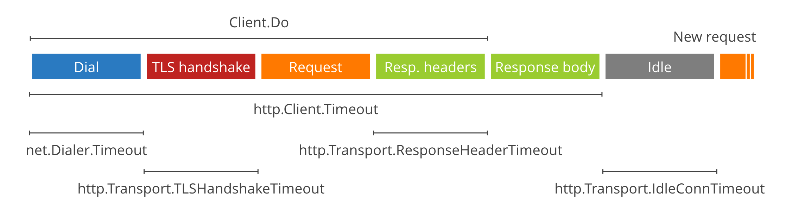

# DevOps  

**Go HTTP client TLS handshake timeout (09/12/2016)**

Various factors could contribute to this error, but mostly it happens when 

1. Insufficient time window to exchange larges certificate
2. Insufficient timeout window without `keepalive`
3. Inappropreate certificate usage
4. ...

<u>For the error #2, we could adjust underlying host to enable `keepalive`</u>

  - [Golang - TLS handshake error](http://stackoverflow.com/questions/34823724/golang-tls-handshake-error)
  - [TCP Keepalive HOWTO](http://tldp.org/HOWTO/TCP-Keepalive-HOWTO/index.html)

<u>For #1, we could implement our own http client like following</u>

```go
client := &http.Client{
    Transport: &http.Transport{
        TLSClientConfig: &tls.Config{InsecureSkipVerify: true}, // disable verify
        Dial: (&net.Dialer{
            Timeout:   60 * time.Second,
            KeepAlive: 60 * time.Second,
        }).Dial,
        // We use ABSURDLY large keys, and should probably not.
        TLSHandshakeTimeout:   60 * time.Second,
        ResponseHeaderTimeout: 60 * time.Second,
        ExpectContinueTimeout: 1 * time.Second,
    },
}

resp, err := client.Get(control.GetGithubAPILink(repo.RepoPage)); if err != nil {
    log.Panic(err.Error())
}
defer resp.Body.Close()
```

<u>**For #3 though, distro specific golang package installation is _the right way_ to go**</u>  
For some time, golang for linux amd64 has been deployed on Ubuntu 16.04 Xenial and there hasn't been an issue on this up until server-side scrapping is launched. When the error happend the fastest way to resolve this was to install `go-golang` package for ubuntu. 



**Make sure your binary is compiled/packaged for the platform you are using!!!**

```sh
# install go for ubuntu
apt install golang-1.6 golang-go

# check install history
less /var/log/apt/history.log

# hold packages update
apt-mark hold golang*

# unhold packages update
apt-mark hold golang*
```

> References

- [The complete guide to Go net_http timeouts](The complete guide to Go net_http timeouts.pdf)
- [Simple Golang HTTPS_TLS Examples](Simple Golang HTTPS_TLS Examples.pdf)